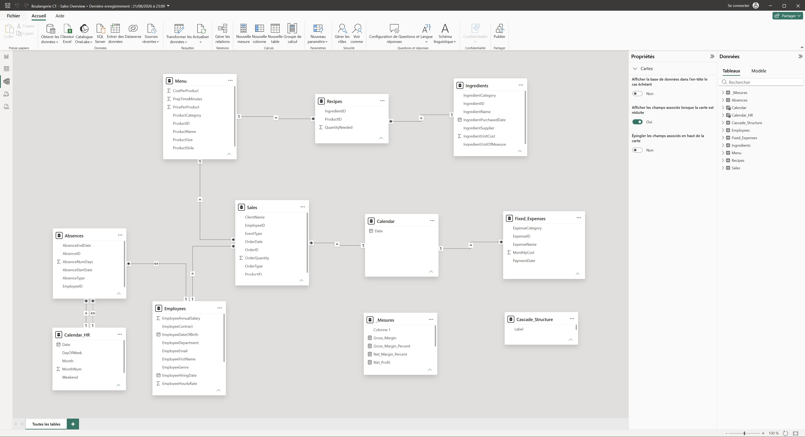
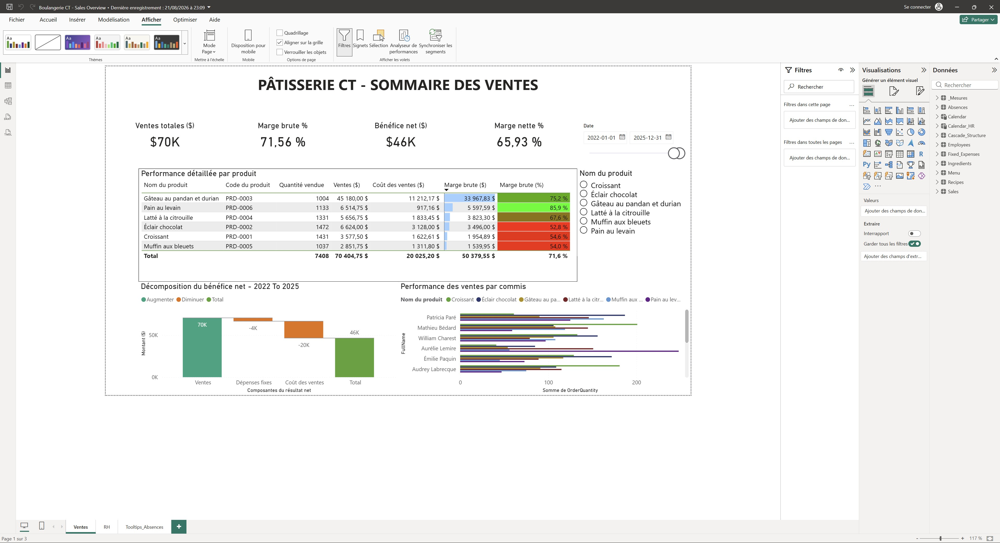
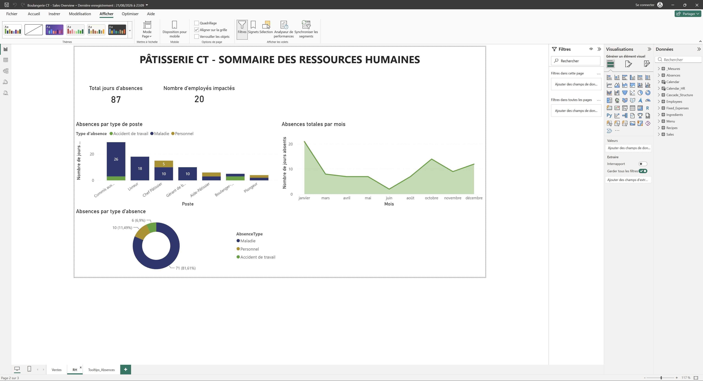

# Data-Analytics-Portfolio
A curated collection of analytics projects built with Power BI, SQL, and Python.  
Includes sales performance and HR absence dashboards for Pâtisserie CT.

# Overview
Power BI dashboards analyzing sales and HR absences performance for Pâtisserie CT.

# Projects Included
- **Sales Performance Dashboard** – Product profitability and employee sales performance. 
- **HR Absence Dashboard** – Employee absences by role, month, and type.

# Objectives
- Sales dashboard showing best‑selling products and seller performance relative to total sales, costs, and net profit. 
- HR dashboard showing employee absences by role, month, and absence type to highlight workforce availability and operational risks.

# Data Preparation
- Generated all source CSV datasets using a Python script (Absences, Employees, Fixed Expenses, Ingredients, Menu, Recipes, Sales). 
- Loaded the CSV files into Power BI Desktop.
- Performed ETL in Power Query (cleaning, standardizing dates, removing duplicates, shaping tables).
- Built fact and dimension tables for the Sales and HR dashboards.

# Data Model
- Star schema connecting HR, Sales, Products, Ingredients, Expenses, and Calendar tables.
- **Fact tables:**
  - Sales (transactions, quantities, product IDs, employee IDs).
  - Absences (absence type, duration, employee IDs).
- **Dimension tables:**
  - Employees (role, department, salary, contract).
  - Menu (products, categories, pricing).
  - Ingredients (unit cost, supplier, category).
  - Recipes (ingredient quantities per product).
  - Fixed_Expenses (monthly costs by category).
  - Calendar and Calendar_HR (date intelligence for sales and HR).
- **Relationships:**
  - One‑to‑many links between dimensions and facts (e.g., Employees → Sales, Employees → Absences, Menu → Sales, Ingredients → Recipes)
  - Calendar tables connected to Sales and Absences for time‑based analysis
- **Purpose:**
  - Supports HR absence analytics, product profitability calculations, seller performance evaluation, and cost allocation.
 

# DAX Measures
This project uses a set of DAX measures to calculate key Sales and HR metrics, including absence totals, sales performance, cost calculations, and profitability indicators. These measures power the visuals in both dashboards and provide the business logic behind the insights.

- **Total Absence Days** – sums all absence durations.
- **Employees Impacted** – counts distinct employees with at least one absence.
- **Absences by Type** – calculates totals for illness, personal leave, and work accidents.

- **Total Sales** – sums all product sales.
- **Total_COGS** – ingredient and recipe costs.
- **Total_Fixed_Expenses** – monthly fixed costs.
- **Gross_Margin** – Sales minus COGS.
- **Gross_Margin_Percent** – Gross Margin divided by Sales.
- **Net_Profit** – Sales minus COGS minus Fixed Expenses.
- **Net_Margin_Percent** – Net Profit divided by Sales.

# Screenshots
Below are selected screenshots from the Sales and HR dashboards, illustrating key visuals, metrics, and insights produced in Power BI.

## Sales Dashboard
- Best‑selling products and category performance.
- Seller performance relative to total sales, costs, and net profit.
- Product profitability visuals (COGS, gross margin, net margin).
- Monthly sales trends and order breakdowns.

## HR Dashboard
- Employee absences by role, month, and absence type.
- Total absence days and employees impacted.
- Absence patterns across departments and time periods.

# Insights
## Sales Insights
- Best‑selling products are concentrated in a few categories, indicating strong customer preference patterns.
- Seller performance varies significantly, with top sellers contributing a disproportionate share of total revenue.
- Products with high COGS but low pricing reduce overall profitability, highlighting opportunities for price adjustments.
- Monthly sales trends reveal peak periods that can guide staffing and inventory planning.

## HR Insights
- Absences are most frequent in specific roles, suggesting potential workload or scheduling issues.
- Illness‑related absences represent the largest share, indicating where wellness initiatives could have the most impact.
- Certain months show spikes in absences, which may correlate with seasonal factors or operational stress periods.
- Departments with higher absence rates may require targeted support or resource reallocation.

# Future Improvements
- Refine expense modeling  
  - Separate fixed and variable costs (e.g., packaging, delivery fees, utilities) to improve product‑level profitability accuracy.

- Add drill‑through pages  
  - Create detailed views for employees, products, and sellers to enhance data exploration and allow deeper analysis.

- Expand date intelligence for Sales  
  - Enrich the Calendar table with Year, Quarter, MonthName, and WeekNum to support more advanced time‑series visuals.

- Improve data validation rules  
  - Add checks in Power Query for missing IDs, negative quantities, mismatched product references, and invalid absence dates.

- Implement row‑level security (RLS)  
  - Restrict HR data to HR managers and hide salary fields for general users to simulate real‑world access control.

- Enable automated data refresh  
  - Store CSVs in OneDrive or SharePoint to allow scheduled refreshes instead of manual file loading.

- Add forecasting visuals  
  - Use Power BI’s built‑in forecasting to project monthly sales and identify future absence trends.

# Repository Structure
Data-Analytics-Portfolio/
│
├── data/               # Source CSV datasets (Absences, Employees, Sales, etc.)
├── model/              # Power BI data model files or schema references
├── notebooks/          # Jupyter notebooks for data generation or exploration
├── pbix/               # Power BI Desktop project files
├── screenshots/        # Dashboard screenshots used in the README
├── scripts/            # Python scripts for dataset creation or cleaning
│
├── LICENSE             # Project license
└── README.md           # Project documentation

# Author
**Huy‑Co Nguyen**  
Aspiring Data/BI Specialist  
Brossard, QC

I'm continuously improving this project as time allows. Future enhancements listed above are possibilities rather than commitments — I'll expand the dashboards and data model when it makes sense.
